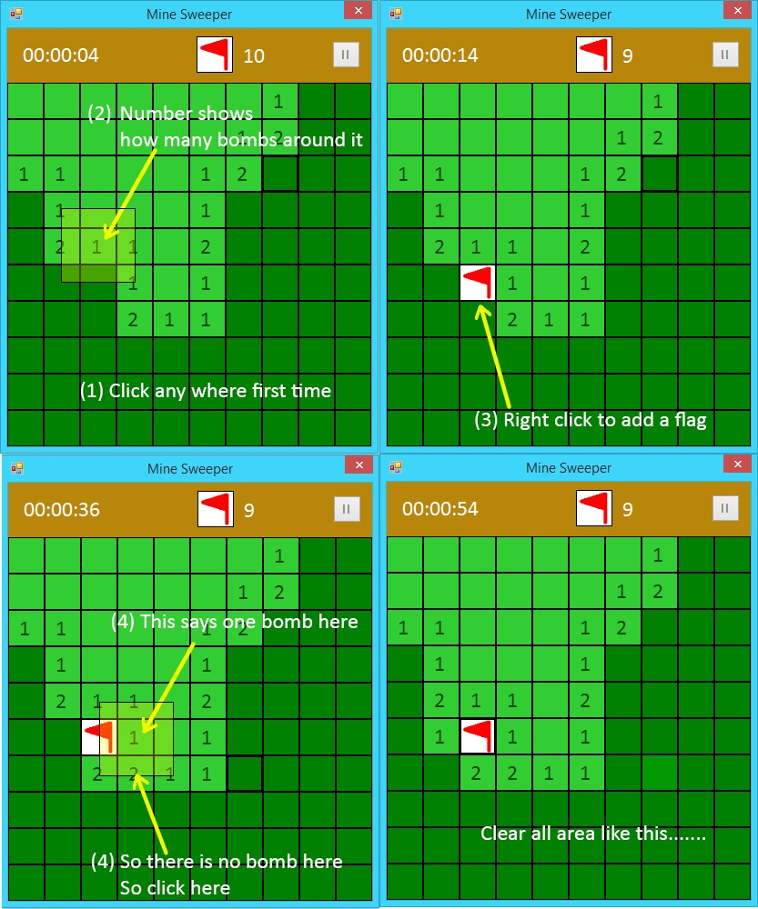

# Mine Sweeper
Minesweeper is a single player puzzle game. The objective of the game is to clear the rectangular ground containing hidden mines without detonating any of them, with help from clues about the number of neighboring mines in each field.

## Download
Go to [releases](https://github.com/renuka-fernando/mine_sweeper/releases) or download the latest from [here](https://github.com/renuka-fernando/mine_sweeper/releases/download/v1.0.0/Mine_Sweeper.exe).

## Instructions

## History
The game originates from the 1960s, and has been written for many computing platforms in use today. It has many variations and offshoots.
